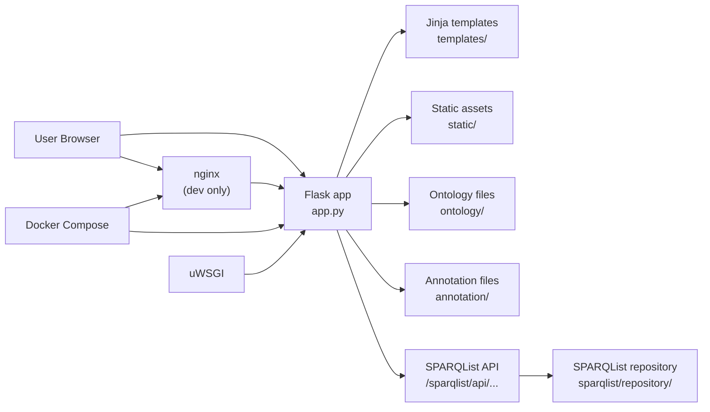

# NanbyoData システム全体図

## この資料の目的

NanbyoData は、Flask で画面を返す Web アプリと、難病オントロジーや SPARQList クエリ資産を組み合わせた構成です。  
最初にこの図を見て、「どのコンポーネントが何を担当しているか」「どこが内部資産で、どこが別サービスか」を把握するのがねらいです。

## ひとことで言うと

- `app.py` が Web アプリの入口
- `templates/` と `static/` が画面側
- `ontology/` と `annotation/` が配布・参照されるデータ資産
- `sparqlist/` が API クエリ定義の別サービス資産
- Docker / uWSGI / nginx が実行基盤

## システム構成図

## コンポーネントの役割

### 1. Flask アプリ

- 入口は `app.py`
- URL ルーティングをまとめて持つ
- 各ページに対応する HTML テンプレートを返す
- 疾患詳細ページでは、ontology と SPARQList API の両方を使う

関連ファイル:
- `app.py`
- `uwsgi/uwsgi.ini`

### 2. テンプレートと静的アセット

- `templates/` は Jinja2 テンプレート
- `static/js/` はページごとの振る舞いを持つ JavaScript
- `static/sass/` と `static/css/` はスタイル
- `static/img/` は画像やアイコン

ここは「画面の見た目・構造」を理解したいときに読む場所です。

### 3. ontology と annotation

- `ontology/` には NANDO のリリース資産がある
- `annotation/` には遺伝子や表現型に関する注釈データがある
- Flask はこれらをダウンロード配布したり、一部をローカル参照したりする

ここは「データの正体」を知りたいときに重要です。

### 4. SPARQList

- `sparqlist/` は SPARQList の運用・設定用ディレクトリ
- `sparqlist/repository/` に API クエリ定義が入っている
- Flask 側は `BASE_URI/sparqlist/api/...` を叩いて概要や関連情報を取得する

ここは「どこから API レスポンスが来るのか」を理解したいときに読みます。

### 5. 実行基盤

- `Dockerfile` で Python 3.8 + pipenv + uWSGI を構成
- `docker-compose.yml` は基本構成
- `docker-compose_for_dev.yml` は開発用で nginx を追加

## 読み始める順番

1. `app.py`
2. `templates/index.html`
3. `templates/disease.html`
4. `static/js/disease/`
5. `sparqlist/repository/`
6. `ontology/`

## 注意点

- コード上は `ontology/current_release/...` を参照している
- リポジトリ上は日付付きリリースディレクトリが中心なので、`current_release` は運用時に別途用意される前提の可能性がある
- `cgi/` は現行 Flask 本体とは別系統の補助資産に見えるため、最初の読解対象としては優先度が低い
