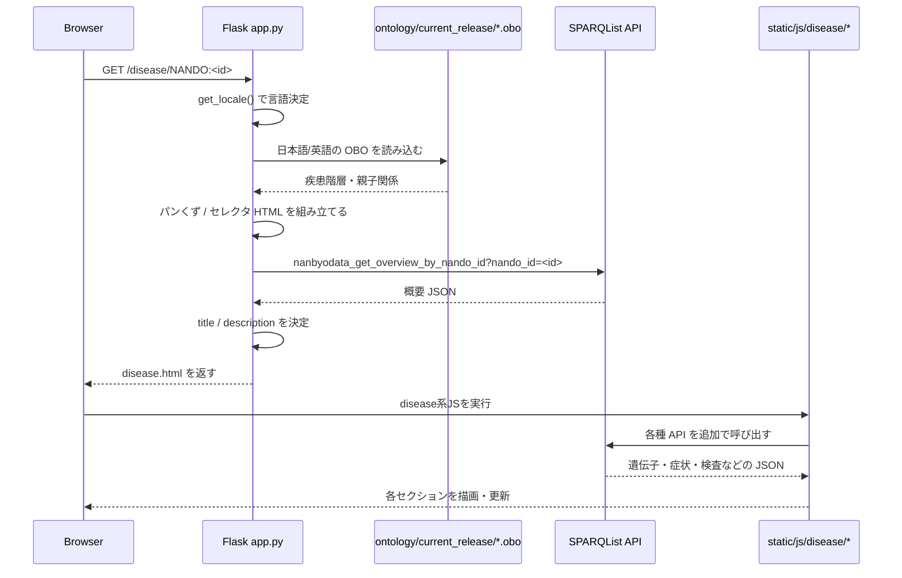

# 疾患ページのリクエストフロー

## この資料の目的

NanbyoData の理解でいちばん大事なのは、`/disease/NANDO:<id>` がどう組み立てられているかです。  
このページでは、Flask、ontology、SPARQList API、フロントエンド JavaScript が連携します。

## 対象 URL

- `/disease/NANDO:2200053` のような疾患詳細ページ

## ひとことで言うと

サーバ側で「ページの骨組みとメタ情報」を作り、クライアント側で「各セクションの詳細データ」を埋めていく構成です。

## シーケンス図

## サーバ側でやっていること

### 1. 言語を決める

- `session['lang']` と `Accept-Language` を使って `ja` / `en` を決める
- この値に応じて日本語 OBO と英語 OBO を切り替える

### 2. ontology から階層を引く

- `pronto` で OBO を開く
- 対象疾患の上位概念をたどる
- 各階層で下位疾患候補を取り、パンくず型の選択 UI を組み立てる

### 3. SPARQList から概要を取る

- `nanbyodata_get_overview_by_nando_id` を呼ぶ
- タイトルや説明文を決める
- それを `disease.html` の SEO メタ情報にも使う

## クライアント側でやっていること

- `templates/disease.html` が基本レイアウトを返す
- `static/js/disease/` 配下のスクリプトが、各セクションのデータ取得やサイドナビ制御を担当する
- つまり、初回 HTML はサーバで生成し、詳細コンテンツは JS で拡張する

## 読むときの着眼点

### まず確認する箇所

- `app.py` の疾患ページルート
- `app.py` の `make_selector_subclasses()`
- `app.py` の `get_overview()`
- `templates/disease.html`
- `static/js/disease/`

### ここが設計上のポイント

- 画面表示の一部はサーバレンダリング
- データ本体の多くは SPARQList API 依存
- 疾患階層ナビゲーションだけはローカル ontology 依存

## 理解チェック用メモ

このページの不具合を切り分けるときは、まず以下のどこで止まっているかを見ると進めやすいです。

1. Flask ルートに到達しているか
2. `ontology/current_release` が正しく置かれているか
3. `BASE_URI` が正しいか
4. SPARQList API が返っているか
5. `static/js/disease/` の追加描画が失敗していないか
