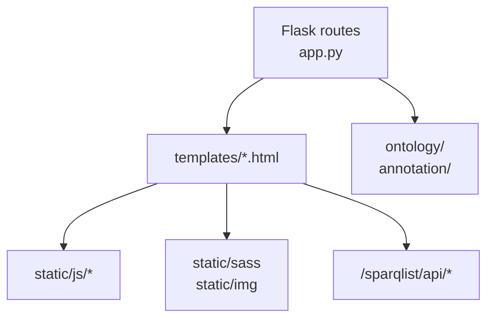

# URL とテンプレート対応表

## この資料の目的

NanbyoData では、Flask のルート、Jinja テンプレート、フロントエンド JavaScript が比較的まっすぐ対応しています。  
この対応表は、「ある URL を直したいときに、どのテンプレートと JS を見ればよいか」をすぐ分かるようにするためのものです。

## ひと目で見る導線

## URL 対応表

| URL | Flask 側の役割 | テンプレート | 主な JS | 備考 |
| --- | --- | --- | --- | --- |
| `/` | トップページ表示 | `templates/index.html` | `static/js/main.js`, `static/js/stats-overview.js` | お知らせ、統計概要、SmartBox を表示 |
| `/api` | API 紹介ページ表示 | `templates/api.html` | `static/js/main.js` | Swagger UI を埋め込む |
| `/about_nanbyodata` | NanbyoData 説明ページ表示 | `templates/about_nanbyodata.html` | `static/js/main.js` | 静的説明ページ |
| `/about_nando` | NANDO 説明ページ表示 | `templates/about_nando.html` | `static/js/main.js` | 静的説明ページ |
| `/datasets` | データセット説明ページ表示 | `templates/datasets.html` | `static/js/main.js` | データ配布案内 |
| `/stats` | 統計ページ表示 | `templates/stats.html` | `static/js/main.js`, `static/js/stats.js` | SPARQList API を複数呼ぶ |
| `/summary` / `/summary/NANDO:<id>` | 疾患サマリーページ表示 | `templates/summary.html` | `static/js/main.js`, `static/js/summary.js` | 既存 API を使って俯瞰型サマリーを表示。顔貌パネルでは世界地図ベースの GestaltMatcher 可視化も行う |
| `/my-diseases` | マイ疾患一覧ページ表示 | `templates/my_diseases.html` | `static/js/main.js`, `static/js/my_diseases.js` | `localStorage` を読み、制度タブとカテゴリ別一覧を表示 |
| `/team` | チームページ表示 | `templates/team.html` | `static/js/main.js`, `static/js/team/team.js` | `static/data/members.json` を読む |
| `/epidemiology` | 疫学ページ表示 | `templates/epidemiology.html` | `static/js/main.js`, `static/js/epidemiology/epidemiology.js` | SPARQList API の患者数表を表示 |
| `/ontology/nando` | NANDO 一覧ページ表示 | `templates/nando.html` | なし | 大きな静的 HTML に近い |
| `/news` | お知らせ一覧表示 | `templates/news.html` | `static/js/main.js`, `static/js/news/news.js` | GitHub 上の Markdown を読む |
| `/disease/NANDO:<id>` | 疾患詳細ページ表示 | `templates/disease.html` | `static/js/disease/disease.js` とその配下 | このシステムの中心導線 |
| `/ontology/<path:filename>` | ontology 配布ファイルを返す | なし | なし | `send_from_directory('ontology', ...)` |
| `/annotation/<path:filename>` | annotation 配布ファイルを返す | なし | なし | `send_from_directory('annotation', ...)` |
| `/feedback` | フィードバック受信 | なし | なし | ログ出力のみの簡易 API |

## 主要ページの見方

### トップページ `/`

- 最初に見るファイル:
  - `app.py`
  - `templates/index.html`
  - `static/js/main.js`
  - `static/js/stats-overview.js`
- 役割:
  - ナビゲーションやニュース概要の表示
  - 統計カードの数値取得
  - 疾患検索 SmartBox の入口

### 疾患ページ `/disease/NANDO:<id>`

- 最初に見るファイル:
  - `app.py`
  - `templates/disease.html`
  - `static/js/disease/disease.js`
- 役割:
  - サーバ側で基本情報とパンくずを生成
  - クライアント側で詳細データを取得して各セクションを描画

### 統計ページ `/stats`

- 最初に見るファイル:
  - `templates/stats.html`
  - `static/js/stats.js`
- 役割:
  - SPARQList API を集約して統計表を表示
  - 複数の API の結果をひとつの画面に合成する

### サマリーページ `/summary/NANDO:<id>`

- 最初に見るファイル:
  - `app.py`
  - `templates/summary.html`
  - `static/js/summary.js`
  - `static/css/summary.css`
- 役割:
  - 疾患詳細ページで使っている API を再利用し、俯瞰しやすい 1 ページサマリーとして表示する
  - ダウンロード用の TXT / JSON も生成する
  - 疾患キャラクターが設定済みなら Hero に表示する
  - HPO データがある場合は、人体図ベースのカテゴリ選択 UI を表示する
  - GestaltMatcher データがある場合は、世界地図 + 単一地域選択の年齢分布 + Patient ID 一覧を表示する

### マイ疾患ページ `/my-diseases`

- 最初に見るファイル:
  - `app.py`
  - `templates/my_diseases.html`
  - `static/js/my_diseases.js`
  - `static/css/summary.css`
- 役割:
  - `localStorage` に保存した疾患を一覧表示する
  - `指定難病` と `小児慢性特定疾病` を制度タブで切り替える
  - 各制度の直下カテゴリごとにグルーピングして表示する

## テンプレートと JS の対応パターン

- 多くのページは `templates/*.html` と `static/js/main.js` の組み合わせ
- データ取得が多いページだけ、専用 JS が追加される
- そのため、変更箇所のあたりを付けるときは次の順番が効率的

1. `app.py` で URL を探す
2. 対応テンプレートを開く
3. 読み込まれている JS を確認する
4. その JS が呼ぶ `/sparqlist/api/*` を追う

## 注意点

- `templates/index.html` や `templates/disease.html` には `/download/latest/...` へのリンクがあるが、`app.py` にはそのルートが見当たらない
- つまりダウンロード系の一部は別サーバや nginx 側で解決している可能性がある
- `templates/nando.html` は非常に大きく、一般的なテンプレートというより生成済み HTML 資産に近い
