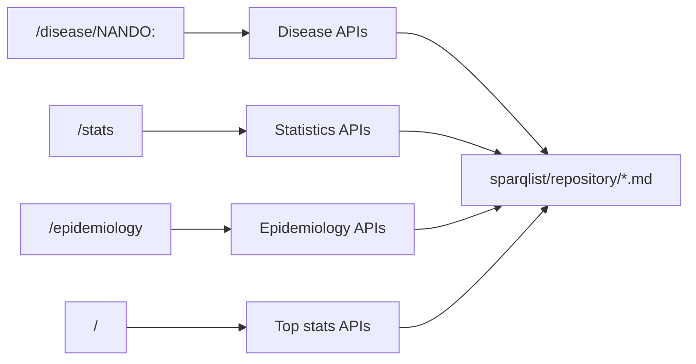

# SPARQList API 一覧

## この資料の目的

NanbyoData では、画面表示の多くが `/sparqlist/api/*` に依存しています。  
この資料では、「どの API がどの画面から使われるか」「まずどこから追うと理解しやすいか」を整理します。

## API の位置づけ

- Flask は画面の入口と一部の整形を担当する
- データ本体の多くは SPARQList API から返る
- API 定義そのものは `sparqlist/repository/*.md` にある

## ひと目で見る関係

## 画面別 API 一覧

### 1. 疾患ページで使う API

主な呼び出し元:

- `app.py`
- `static/js/disease/disease.js`

| API 名 | 主な用途 | 主な呼び出し元 |
| --- | --- | --- |
| `nanbyodata_get_overview_by_nando_id` | 疾患概要、タイトル、説明文 | `app.py`, `static/js/disease/disease.js` |
| `nanbyodata_get_link_omim_by_nando_id` | OMIM 外部リンク | `static/js/disease/disease.js` |
| `nanbyodata_get_link_orphanet_by_nando_id` | Orphanet 外部リンク | `static/js/disease/disease.js` |
| `nanbyodata_get_link_mondo_by_nando_id` | MONDO / Monarch 系リンク | `static/js/disease/disease.js` |
| `nanbyodata_get_link_medgen_by_nando_id` | MedGen 外部リンク | `static/js/disease/disease.js` |
| `nanbyodata_get_link_kegg_by_nando_id` | KEGG 外部リンク | `static/js/disease/disease.js` |
| `nanbyodata_get_japan_curated_gene_by_nando_id` | 国内基準由来の遺伝子 | `static/js/disease/disease.js` |
| `nanbyodata_get_causal_gene_by_nando_id` | 国際リソース由来の遺伝子 | `static/js/disease/disease.js` |
| `nanbyodata_get_glycosmos_gene_by_nando_id` | 糖鎖関連遺伝子 | `static/js/disease/disease.js` |
| `nanbyodata_get_genetic_test_by_nando_id` | 診療用遺伝学的検査 | `static/js/disease/disease.js` |
| `nanbyodata_get_hpo_data_by_nando_id` | 臨床的特徴 | `static/js/disease/disease.js` |
| `nanbyodata_get_nbdc_human_databases_info_by_nando_id` | Human Genomic Datasets | `static/js/disease/disease.js` |
| `nanbyodata_get_riken_brc_cell_info_by_nando_id` | 細胞バイオリソース | `static/js/disease/disease.js` |
| `nanbyodata_get_riken_brc_mouse_info_by_nando_id` | マウスバイオリソース | `static/js/disease/disease.js` |
| `nanbyodata_get_riken_brc_dna_info_by_nando_id` | DNA バイオリソース | `static/js/disease/disease.js` |
| `nanbyodata_get_clinvar_variant_by_nando_id` | ClinVar バリアント | `static/js/disease/disease.js` |
| `nanbyodata_get_mgend_variant_by_nando_id` | MGeND バリアント | `static/js/disease/disease.js` |
| `nanbyodata_get_gestaltmatcher_data_by_nando_id` | 顔貌特徴 | `static/js/disease/disease.js` |
| `nanbyodata_get_pubchem_chemical_information_by_nando_id` | 化合物情報 | `static/js/disease/disease.js` |
| `nanbyodata_get_pubmed_data_by_nando_id` | 参考文献 | `static/js/disease/disease.js` |
| `nanbyodata_get_stats_on_patient_number_by_nando_id` | 患者数 | `static/js/disease/disease.js` |
| `nanbyodata_get_sub_class_by_nando_id` | 下位疾患一覧 | `static/js/disease/disease.js` |

### 1.5. サマリーページで使う API

主な呼び出し元:

- `static/js/summary.js`

| API 名 | 主な用途 | 主な呼び出し元 |
| --- | --- | --- |
| `nanbyodata_get_overview_by_nando_id` | Hero の疾患名、説明、基本情報 | `static/js/summary.js` |
| `nanbyodata_get_stats_on_patient_number_by_nando_id` | 患者数推移、基本情報の患者数 | `static/js/summary.js` |
| `nanbyodata_get_sub_class_by_nando_id` | 病型分類、サブタイプカードの統計 | `static/js/summary.js` |
| `nanbyodata_get_japan_curated_gene_by_nando_id` | 国内由来の関連遺伝子、基本情報の国内遺伝子数 | `static/js/summary.js` |
| `nanbyodata_get_causal_gene_by_nando_id` | 国際由来の関連遺伝子、基本情報の国際遺伝子数 | `static/js/summary.js` |
| `nanbyodata_get_hpo_data_by_nando_id` | 臨床概要、HPO カテゴリ、人体ナビ | `static/js/summary.js` |
| `nanbyodata_get_gestaltmatcher_data_by_nando_id` | 顔貌・視覚的特徴、世界地図、年齢分布、Patient ID 一覧 | `static/js/summary.js` |
| `nanbyodata_get_pubmed_data_by_nando_id` | 最新関連文献、関連文献一覧 | `static/js/summary.js` |
| `nanbyodata_get_link_mondo_by_nando_id` | 外部リンク、MONDO カード | `static/js/summary.js` |
| `nanbyodata_get_link_orphanet_by_nando_id` | 外部リンク | `static/js/summary.js` |
| `nanbyodata_get_link_medgen_by_nando_id` | 外部リンク | `static/js/summary.js` |
| `nanbyodata_get_link_kegg_by_nando_id` | 外部リンク | `static/js/summary.js` |
| `nanbyodata_get_link_omim_by_nando_id` | 外部リンク、OMIM リンク | `static/js/summary.js` |
| `nanbyodata_get_genetic_test_by_nando_id` | 分子・診断パネルの遺伝学的検査 | `static/js/summary.js` |
| `nanbyodata_get_clinvar_variant_by_nando_id` | 分子・診断パネルの ClinVar | `static/js/summary.js` |
| `nanbyodata_get_mgend_variant_by_nando_id` | 分子・診断パネルの MGeND | `static/js/summary.js` |
| `nanbyodata_get_glycosmos_gene_by_nando_id` | 分子・診断パネルの GlyCosmos | `static/js/summary.js` |
| `nanbyodata_get_nbdc_human_databases_info_by_nando_id` | リソース件数 | `static/js/summary.js` |
| `nanbyodata_get_riken_brc_cell_info_by_nando_id` | リソース件数 | `static/js/summary.js` |
| `nanbyodata_get_riken_brc_mouse_info_by_nando_id` | リソース件数 | `static/js/summary.js` |
| `nanbyodata_get_riken_brc_dna_info_by_nando_id` | リソース件数 | `static/js/summary.js` |
| `nanbyodata_get_pubchem_chemical_information_by_nando_id` | リソース件数 | `static/js/summary.js` |

サマリーページでは、上の SPARQList API に加えて次の外部 API も利用しています。

| API / URL | 主な用途 | 主な呼び出し元 |
| --- | --- | --- |
| `https://api-v3.monarchinitiative.org/v3/api/entity/{MONDO_ID}` | MONDO xref から `GARD:xxxx` を解決し、GARD 外部リンクを補完する | `static/js/summary.js` |

補足:

- 遺伝形式カードは `nanbyodata_get_overview_by_nando_id` の `inheritance_uris` を利用する
- `OMIM` は `nanbyodata_get_link_omim_by_nando_id` から取得する
- `GARD` は NanbyoData 側に専用 API がないため、現状は Monarch API 依存になっている
- そのため、summary の外部リンクまわりで外部 API 依存を整理するときは、この Monarch 連携が改修対象になる

TODO:

- summary の `GARD` 取得は Monarch API 依存なので、NanbyoData 側に専用 API が追加できたら置き換える
- 置き換え候補の責務は「`NANDO ID -> GARD 外部リンク` の解決」
- 影響箇所は `static/js/summary.js` の外部リンク生成まわり

### 2. 統計ページで使う API

主な呼び出し元:

- `static/js/stats.js`

| API 名 | 主な用途 |
| --- | --- |
| `NANDO_count` | 難病件数の集計 |
| `NANDO_link_count` | 外部リンク系の集計 |
| `NANDO_link_count2` | 遺伝子、遺伝学的検査、臨床特徴の集計 |
| `NANDO_link_count3` | バイオリソース集計 |
| `NANDO_link_count4` | 顔貌特徴集計 |
| `NANDO_link_count5` | 追加統計の集計 |
| `NANDO_link_count7` | ClinVar 系集計 |
| `NANDO_link_count8` | 糖鎖関連遺伝子集計 |

### 3. トップページの統計概要で使う API

主な呼び出し元:

- `static/js/stats-overview.js`

| API 名 | 主な用途 |
| --- | --- |
| `NANDO_count` | 難病総数カード |
| `NANDO_link_count` | 外部リンク数カード |
| `NANDO_link_count2` | 遺伝子、検査、臨床特徴カード |
| `NANDO_link_count3` | バイオリソースカード |
| `NANDO_link_count4` | 顔貌特徴カード |
| `NANDO_link_count8` | 糖鎖関連遺伝子カード |

### 4. 疫学ページで使う API

主な呼び出し元:

- `static/js/epidemiology/epidemiology.js`

| API 名 | 主な用途 |
| --- | --- |
| `nanbyodata_get_stats_on_patient_number_shitei` | 指定難病の患者数表 |
| `nanbyodata_get_stats_on_patient_number_shoman` | 小児慢性特定疾病の患者数表 |

## 優先して理解するとよい API

初学者向けのおすすめ順は次の通りです。

1. `nanbyodata_get_overview_by_nando_id`
2. `nanbyodata_get_hpo_data_by_nando_id`
3. `nanbyodata_get_japan_curated_gene_by_nando_id`
4. `NANDO_count`
5. `NANDO_link_count2`

理由:

- 疾患ページの中心導線と統計ページの中心導線を押さえられる
- UI で目に見える値と対応しやすい
- API の粒度が分かりやすい

## repository の見方

SPARQList API を追うときは、次の順番で見ると理解しやすいです。

1. 画面側の JS で API 名を確認する
2. `sparqlist/repository/<api名>.md` を開く
3. 返却項目の名前を画面側の参照箇所と照合する
4. 必要なら関連 API を横に読む

## 注意点

- `sparqlist/repository/` には本番利用 API 以外に、`test_*`, `shin_*`, `EX_*`, `pcf_*` など実験・補助・別用途のファイルも多い
- そのため、最初は「画面から実際に参照されている API 名」だけに絞って追うのが安全
- `NANDO_link_count5` など一部の API は統計画面専用で、トップページや疾患ページでは未使用のものがある
